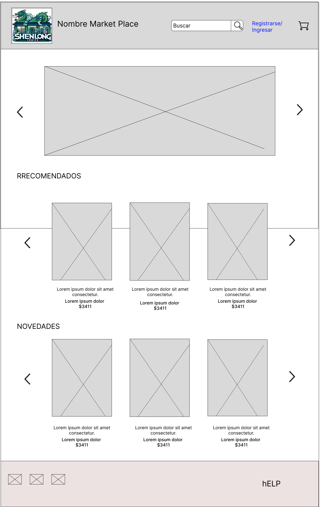
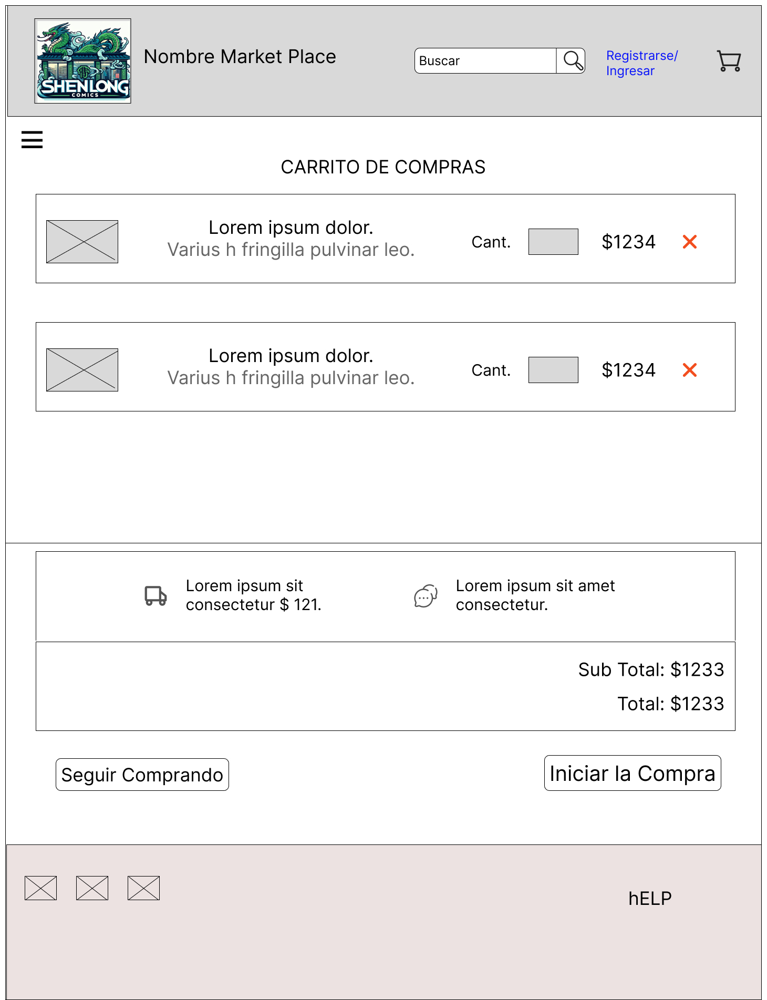
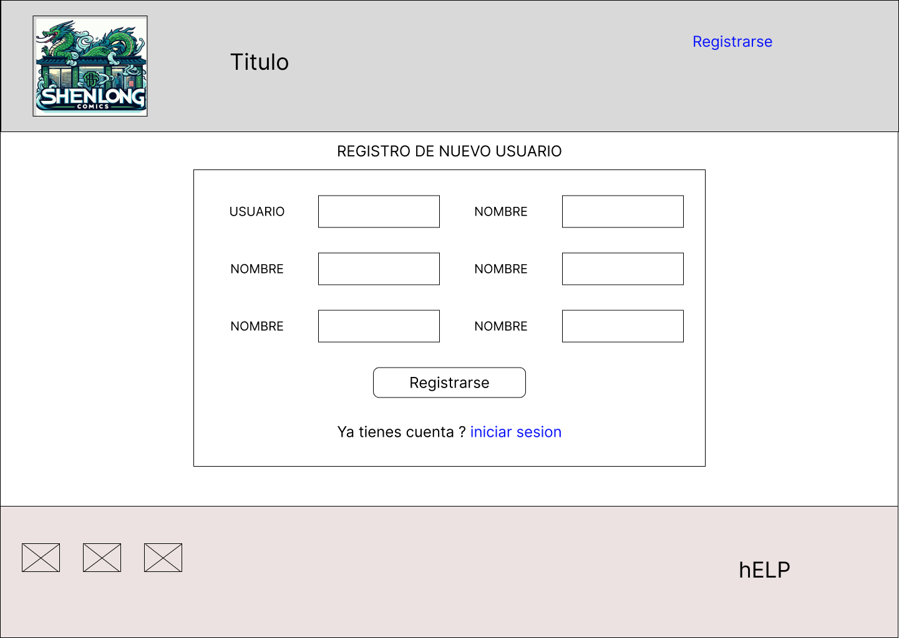
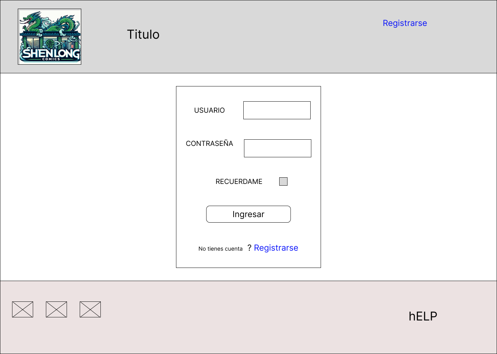
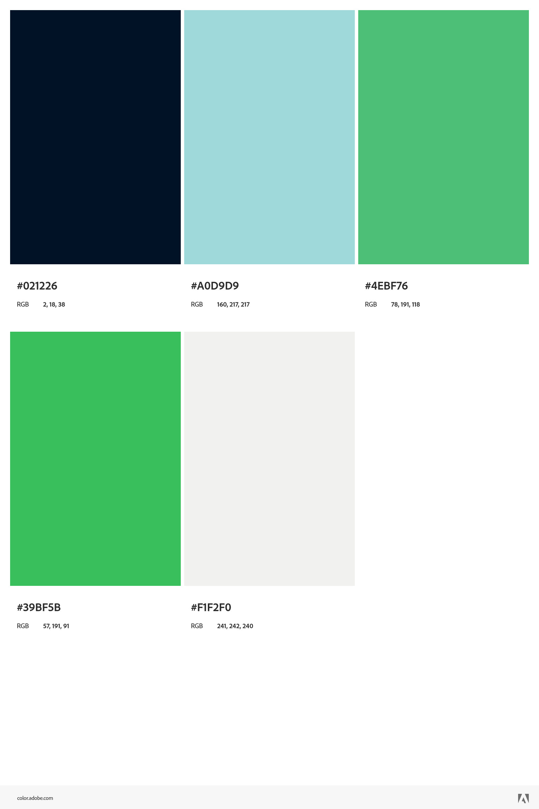
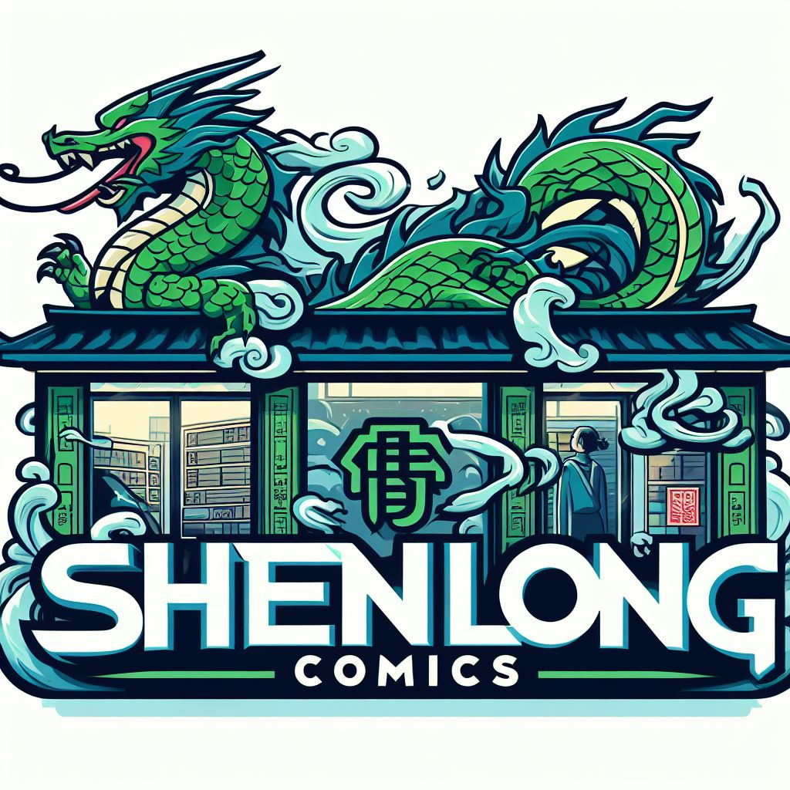

# grupo_#6_ShenlongComics #

## Definir la temática del Market Place ##

** Nombre del Market Place: Shenlong comics **
* *La librería de cómics "Shenlong comics" se especializa en la venta de cómics, novelas gráficas, mangas y otros productos relacionados con el mundo de la narrativa visual. Nuestra oferta incluye una amplia gama de cómics de diferentes géneros, desde superhéroes y ciencia ficción hasta fantasía y manga. También ofrecemos ediciones especiales, cómics antiguos, mercancía relacionada con cómics y una selección de arte y libros sobre la creación de cómics. *
* * Nuestra librería de cómics está diseñada para satisfacer a personas de todas las edades que adoran los cómics y la narrativa visual. Nos enfocamos en ofrecer una amplia gama de géneros y estilos para atraer a cualquier persona interesada en la cultura geek. *

  ** Integrantes del equipo. **
 * Candela Elizondo
 * Fatima G. Diaz
 * Joaquin Gonzalez
 * Lucas Giovani Depaoli
 * Tomás Palmas

## Inspiración en referentes del mercado ##
*  [La Revisteria](https://www.larevisteriacomics.com/)
*  [Legion Comics](https://legioncomics.com.ar/?gclid=CjwKCAjw7c2pBhAZEiwA88pOF_ujKBgkKBJ7FuWjho0r3lBGy7u1JuYz7VxVvdbwaLAOucKaRy3iihoCbSkQAvD_BwE#!/-inicio-novedades-2/)
*  [El club del Comic](http://www.clubdelcomic.com.ar/)
*  [El club del Comic](http://www.clubdelcomic.com.ar/)
*  [Elektra Comics](https://www.elektracomics.com.ar/)
*  [Crossover Comics](https://www.crossover-comics.com/)
 

## Wireframe y un boceto del sitio ##
** [Link del Fgma con los bocetos](https://www.figma.com/proto/NlyXyLDtrpoGPDma7o6e6w/Proyecto-DH?type=design&node-id=69-2863&t=CvuDnhpG11U7kjSz-1&scaling=scale-down&page-id=0%3A1&mode=design )**

- [x] Home
    
- [x] Detalle de producto
    
- [x] Carrito de compras
    
- [x] Formulario de registro
    
- [x] Formulario de login
    

### Paleta de Colores ###

### Logo ###

## Tablero de Trtabajo Shenlong Comics ##
[Tablero de trabajo Trello](https://trello.com/invite/b/E9x4EefD/ATTIb3569053cbdc9d852885bd63aef34fe0B7355910/tablero-de-trabajo-shenlongcomics)

